# Longform Production Factory Design

작성일: 2026-05-13
브랜치: `codex/content-profile-longform-20260513`
기준 repo: `eureka-flow`
참고 공장: `/Users/a0000/Library/Mobile Documents/com~apple~CloudDocs/Desktop/dev/Remotion_youtube`

## 1. 목표

`eureka-flow` 안에 쇼츠와 분리된 롱폼 제작 공장을 만든다. 사용자가 “롱폼 만들어줘”라고 요청하면 시스템은 원문과 보조자료를 수집하고, 대본과 시각 스토리보드를 먼저 만든 뒤, 사용자가 승인한 경우에만 TTS, SRT, 모션그래픽 composition, 2K MP4 렌더, QA, 미리보기와 다운로드까지 진행한다.

이번 작업은 쇼츠 플로우를 건드리지 않는다. 롱폼은 이미지 생성 중심 기능이 아니므로 사용자가 장면 수나 화풍을 고르지 않는다. 장면과 모션 챕터는 대본 길이, 자료 구조, 정보 밀도, 증거 제시 필요성에 따라 시스템이 자동 산정한다.

## 2. 비목표

- 쇼츠 proposal UI, 쇼츠 장면 수, 쇼츠 화풍 선택, 쇼츠 이미지 생성 경로 변경
- Sora 같은 단일 비디오 생성 API로 전체 영상을 한 번에 만드는 방식
- Remotion_youtube repo 코드를 통째로 복사하는 방식
- placeholder MP4를 성공 산출물로 간주하는 방식
- 롱폼 사용자가 장면 수, 이미지 화풍, 이미지 품질을 직접 고르는 UX
- 승인 전 TTS, HyperFrames, Remotion, MP4 render 같은 유료 제작 실행

## 3. 제품 원칙

1. 롱폼은 “이미지 슬라이드쇼”가 아니라 “대본 기반 모션그래픽 영상”이다.
2. URL이 있으면 원문이 1순위 source다. 웹 검색은 보강, 반론, 최신성 확인에만 사용한다.
3. 영상 품질은 `대본 -> visual storyboard -> scene JSON -> timing -> motion -> render QA` 순서로 잠근다.
4. 자막 한 줄마다 화면을 갈아끼우지 않는다. 3-8개 subtitle cue를 하나의 visual chapter로 묶고, cue는 그 안에서 포커스와 강조만 바꾼다.
5. SRT는 TTS 출력 timing cue를 timing truth로 삼는다. 전역 비율로 자막 시간을 늘려 맞추는 방식은 금지한다.
6. 비용은 provider 호출 전에 차단한다. 롱폼 HTML/HyperFrames compose+render 예상 비용은 1회 attempt 기준 `$5.00`을 넘으면 실행하지 않는다.
7. 완료 기준은 실제 MP4, audio/video stream, 2K 해상도, duration, subtitle timing, preview/download 확인이다.

## 4. 전체 흐름

```text
사용자 요청
  -> longform.source
  -> longform.brief
  -> longform.script
  -> longform.storyboard
  -> longform.scene-json
  -> longform.review
  -> longform.tts
  -> longform.srt-align
  -> longform.motion-compose
  -> longform.render
  -> longform.qa
  -> longform.package
```

Gate A는 `source`부터 `review`까지다. Gate A는 대본, 스토리보드, renderer 입력 계약을 만들지만 유료 media execution을 시작하지 않는다.

Gate B는 `tts`부터 `package`까지다. Gate B는 사용자가 Gate A 산출물을 승인한 뒤에만 실행한다.

## 4.1 B 설계도: 사용자에게는 하나의 제작 공장, 내부적으로는 두 단계

사용자 입장에서는 A/B가 별도 제품처럼 보이면 안 된다. 화면에는 “롱폼 제작 공장” 하나만 보이고, 실행 상태가 아래처럼 자연스럽게 바뀐다.

```text
1차 실행: 자료 수집 -> 대본/스토리보드/장면 계약 -> 사용자 검수 대기
사용자 승인: 검수본 저장/승인
2차 실행: Adam/ElevenLabs TTS -> SRT 정렬 -> 모션 구성 -> 2K MP4 렌더 -> QA -> 다운로드 패키지
```

내부 실행 모드는 다음 계약으로만 나뉜다.

| 단계   | 실행 모드              | 비용 성격            | 사용자에게 보여줄 표현                    | 완료 조건                                                            |
| ------ | ---------------------- | -------------------- | ----------------------------------------- | -------------------------------------------------------------------- |
| Gate A | `executionMode:"step"` | 기획/텍스트 중심     | `롱폼 기획안 생성 중`                     | `longform-review` 노드에 검수 가능한 대본/스토리보드/scene JSON 표시 |
| 승인   | 사용자 action          | 비용 없음            | `대본 검수본 저장됨. 영상 제작 실행 가능` | review node config에 `reviewedOutput` 저장                           |
| Gate B | `executionMode:"full"` | TTS/render 유료 가능 | `영상 제작 중`                            | `longform-package`에 preview/download/QA report 표시                 |

## 4.2 노드 설계도

| 순서 | 노드                      | Gate | 역할                                       | 주요 입력                                       | 주요 출력                                           | 프론트 표시                        | 실패 시                                               |
| ---- | ------------------------- | ---- | ------------------------------------------ | ----------------------------------------------- | --------------------------------------------------- | ---------------------------------- | ----------------------------------------------------- |
| 1    | `longform-source`         | A    | URL 원문과 보조자료를 source digest로 정리 | userRequest, urls, articles                     | primarySources, sourceDigest, factualSpine          | 원문 요약, 핵심 claim, 출처 링크   | 원문 추출 실패 시 검색 fallback 또는 source 부족 실패 |
| 2    | `longform-brief`          | A    | 영상 관점과 구조 확정                      | sourceDigest, factualSpine                      | titleCandidates, viewerPromise, angle, evidencePlan | “무슨 관점으로 설명할지” 카드      | 관점/근거 누락 시 실패                                |
| 3    | `longform-script`         | A    | 검수 가능한 내레이션 대본 작성             | brief, evidencePlan                             | fullScriptDraft, sections, sourceMap                | 긴 대본 viewer/editor              | 원문 factual spine 이탈 시 QA 실패 대상               |
| 4    | `longform-storyboard`     | A    | 대본 section을 visual chapter로 변환       | sections, sourceMap                             | visualChapters                                      | 챕터별 화면 의도/구성              | cue 단위 scene 남발 시 실패                           |
| 5    | `longform-scene-json`     | A    | renderer 계약 생성                         | visualChapters                                  | renderer, resolution, scenes, perCueActivity        | scene JSON 요약                    | 2K/renderer/motion 계약 누락 시 실패                  |
| 6    | `longform-review`         | A    | 사용자 검수/승인 경계                      | scene-json artifact, reviewedOutput             | reviewStatus, approvedGateAArtifact                 | 대본 검수 textarea, 승인 저장 버튼 | 승인 전 Gate B 차단                                   |
| 7    | `longform-tts`            | B    | 승인 대본으로 ElevenLabs TTS 생성          | approvedGateAArtifact, sections/fullScriptDraft | audio, transcriptText, normalizedScenes             | 오디오 플레이어, voice/provider    | ElevenLabs key/voice/audio 실패                       |
| 8    | `longform-srt-align`      | B    | TTS 기준 subtitle timing 생성              | audio, transcriptText                           | subtitleCues, alignmentMethod, driftWarnings        | 자막 cue table                     | TTS timing/drift 실패                                 |
| 9    | `longform-motion-compose` | B    | 장면 계약과 자막을 모션 cue로 변환         | scenes, subtitleCues                            | motionCues, compositionHtml/projectPath             | 모션 cue 수, composition summary   | motion cue 0개면 실패                                 |
| 10   | `longform-render`         | B    | HyperFrames-compatible 2K MP4 렌더         | audio, subtitleCues, motionCues, scene-json     | video previewUrl/downloadUrl                        | video preview, 다운로드 버튼       | 비용 초과, audio/video stream/ffmpeg 실패             |
| 11   | `longform-qa`             | B    | 최종 QA 판정                               | video, subtitleCues, motionCues                 | qaReport                                            | pass/fail checklist                | stream/duration/resolution/subtitle 실패              |
| 12   | `longform-package`        | B    | 사용자 산출물 패키징                       | video, qaReport, source/script/scene artifacts  | mp4Url, downloadUrl, qaReport                       | 최종 다운로드 카드                 | preview/download 누락 시 실패                         |

```mermaid
flowchart LR
    subgraph A["Gate A: 기획/검수"]
        S["longform-source<br/>원문 digest"]
        B["longform-brief<br/>관점/구조"]
        C["longform-script<br/>대본 초안"]
        D["longform-storyboard<br/>visual chapters"]
        E["longform-scene-json<br/>renderer 계약"]
        R["longform-review<br/>사용자 검수"]
    end

    subgraph G["승인 경계"]
        AP["approvedGateAArtifact"]
    end

    subgraph P["Gate B: 제작/검증"]
        T["longform-tts<br/>ElevenLabs Adam"]
        A1["longform-srt-align<br/>TTS timing cues"]
        M["longform-motion-compose<br/>motion cues"]
        V["longform-render<br/>2K MP4"]
        Q["longform-qa<br/>ffprobe QA"]
        K["longform-package<br/>preview/download"]
    end

    S --> B --> C --> D --> E --> R
    R -->|"검수본 저장/승인"| AP
    AP --> T --> A1 --> M --> V --> Q --> K
```



## 4.3 데이터 전달선

롱폼 B에서 가장 중요한 것은 `approvedGateAArtifact`가 끊기지 않는 것이다. 승인 artifact는 review 노드에서만 만들어지고, 후속 노드는 그 artifact를 복사해서 다음 출력에 다시 포함한다.

```text
longform-review.output.approvedGateAArtifact
  -> longform-tts.input.approvedGateAArtifact
  -> longform-srt-align.input.approvedGateAArtifact
  -> longform-motion-compose.input.approvedGateAArtifact
  -> longform-render.input.approvedGateAArtifact
  -> longform-qa.input.approvedGateAArtifact
  -> longform-package.input.approvedGateAArtifact
```

이 전달선이 끊기면 B는 실패해야 한다. downstream 노드 config에 `gateBApproved:true`를 하드코딩해서 우회하면 안 된다.

## 4.4 B 실행 상태 설계

Gate B 실행 중 사용자가 봐야 하는 상태는 노드별로 분리한다.

| 상태                              | 표시 문구                       | 진행률 기준               |
| --------------------------------- | ------------------------------- | ------------------------- |
| `longform-tts` running            | `ElevenLabs Adam 음성 생성 중`  | TTS 요청 시작/완료        |
| `longform-srt-align` running      | `자막 타이밍 정렬 중`           | cue 생성 수               |
| `longform-motion-compose` running | `모션그래픽 장면 구성 중`       | motion cue 생성 수        |
| `longform-render` running         | `2K MP4 렌더링 중`              | ffmpeg render 시작/완료   |
| `longform-qa` running             | `영상 품질 검사 중`             | QA checklist pass 수      |
| `longform-package` completed      | `미리보기와 다운로드 준비 완료` | preview/download URL 존재 |

캔버스는 현재 실행 중인 노드를 강조해야 한다. 우측 agent panel은 전체 워크플로우 상태만이 아니라 “현재 노드명 + 사람이 이해할 수 있는 작업 설명”을 표시해야 한다.

## 5. 롱폼 블록 계약

### 5.1 `longform-source`

역할: URL 원문, 사용자 brief, 보조자료를 수집하고 source digest를 만든다.

입력:

```ts
{
    userRequest: string;
    urls?: string[];
}
```

출력:

```ts
{
    primarySources: SourceRef[];
    supportingSources: SourceRef[];
    sourceDigest: string[];
    factualSpine: {
        who?: string;
        what: string;
        when?: string;
        whyItMatters: string;
        disputes?: string[];
        caveats?: string[];
    };
    requestText: string;
}
```

규칙:

- URL이 있으면 URL 원문을 먼저 읽는다.
- 원문 추출 실패 시에만 검색 fallback을 사용한다.
- primary source와 supporting source를 섞지 않는다.
- XML/HTML 원문 덤프를 그대로 다음 노드에 넘기지 않는다. 사람이 읽을 수 있는 digest와 핵심 claim만 넘긴다.

### 5.2 `longform-brief`

역할: 영상의 관점, 시청자 약속, 논리 구조를 정한다.

출력:

```ts
{
    titleCandidates: string[];
    viewerPromise: string;
    targetViewer: string;
    angle: string;
    structure: 'problem-reframe' | 'timeline' | 'explainer' | 'documentary';
    estimatedDurationSec: number;
    evidencePlan: Array<{
        sourceId: string;
        useAt: 'hook' | 'context' | 'turning-point' | 'proof' | 'conclusion';
        visualUse: 'source-proof' | 'quote-card' | 'metric-reveal' | 'timeline';
    }>;
}
```

규칙:

- 기본 목표 길이는 3-5분이다.
- 사용자가 길이를 명시하면 그 길이를 상한으로 쓴다.
- 장면 수는 여기서 사용자 선택값으로 받지 않는다.

### 5.3 `longform-script`

역할: 최종 내레이션 초안을 작성한다.

출력:

```ts
{
    fullScriptDraft: string;
    sections: Array<{
        sectionId: string;
        title: string;
        narration: string;
        purpose: 'hook' | 'context' | 'explain' | 'evidence' | 'turn' | 'conclusion';
    }>;
    sourceMap: Array<{
        sectionId: string;
        sourceIds: string[];
    }>;
}
```

규칙:

- 원문이 있는 요청은 원문의 factual spine을 벗어나지 않는다.
- 출처가 필요한 주장은 `sourceMap`에 연결한다.
- 과장된 쇼츠식 어투를 기본값으로 쓰지 않는다.

### 5.4 `longform-storyboard`

역할: 대본 section을 visual chapter로 바꾼다.

출력:

```ts
{
    visualChapters: Array<{
        chapterId: string;
        sectionId: string;
        headline: string;
        visualArchetype:
            | 'source-proof'
            | 'timeline'
            | 'comparison'
            | 'metric-reveal'
            | 'workflow-map'
            | 'quote-card'
            | 'chapter-board'
            | 'concept-map';
        viewerPurpose: string;
        objects: VisualObject[];
        motionPlan: string;
        evidenceRefs: string[];
    }>;
}
```

규칙:

- subtitle cue 하나를 scene 하나로 만들지 않는다.
- 한 visual chapter는 보통 3-8개 cue를 가진다.
- card, connector, progress line, source crop, counter, highlight mask, focus ring처럼 화면 안에서 움직일 정보 구조를 정의한다.
- 이미지 생성 프롬프트를 중심 산출물로 만들지 않는다.

### 5.5 `longform-scene-json`

역할: renderer가 읽을 수 있는 장면 계약으로 변환한다.

출력:

```ts
{
    renderer: 'hyperframes' | 'remotion-local';
    resolution: '2560x1440';
    fps: 30;
    scenes: Array<{
        sceneId: string;
        chapterId: string;
        layout: string;
        headline: string;
        objects: VisualObject[];
        perCueActivity: Array<{
            cueIndex: number;
            activeObjectIds: string[];
            emphasis: 'highlight' | 'draw-line' | 'count-up' | 'zoom' | 'mask' | 'reveal';
        }>;
    }>;
}
```

규칙:

- renderer 기본값은 `hyperframes`다.
- `remotion-local`은 로컬 테스트/대체 adapter일 뿐, 제품 기본 route가 아니다.
- 장면 수는 `visualChapters.length`로 결정되며 사용자 입력값이 아니다.

### 5.6 `longform-review`

역할: Gate A 산출물을 사용자에게 보여주고 승인/수정/거절을 기록한다.

상태:

```ts
{
    reviewStatus: 'draft' | 'approved' | 'rejected' | 'changes-requested';
    approvedArtifactId?: string;
    reviewNote?: string;
    decidedAt?: string;
}
```

규칙:

- `approved` 전에는 Gate B 노드를 실행하지 않는다.
- `changes-requested`는 기존 artifact를 덮어쓰지 않고 새 attempt를 만든다.
- 프론트에서 저장된 `reviewedOutput`은 승인된 Gate A artifact로 승격된다.
- 승인 artifact는 `approvedGateAArtifact`, `reviewStatus:"approved"`, `mediaExecutionAllowed:true`, `gateBApproved:true`를 포함해야 한다.
- 승인 신호는 review 노드 하나에만 머무르면 안 된다. 실행 중에는 `longform-review -> longform-tts -> ... -> longform-render` 입력 payload를 통해 끝까지 전달되어야 한다.

### 5.7 `longform-tts`

역할: 승인된 대본으로 ElevenLabs TTS를 생성한다.

출력:

```ts
{
    audio: {
        url: string;
        durationSec: number;
        provider: 'elevenlabs';
        voiceId: string;
    }
    transcriptText: string;
}
```

규칙:

- 기본 voice는 설정값을 따른다.
- 롱폼은 ElevenLabs provider를 요구한다.
- `fullScriptDraft` 또는 `sections[].narration`을 `normalizedScenes`로 변환해 기존 TTS 엔진에 넘긴다.
- TTS 출력은 승인 artifact, scene contract, source metadata를 버리면 안 된다. 후속 SRT/motion/render 노드가 같은 payload를 이어받아야 한다.

### 5.8 `longform-srt-align`

역할: TTS 기준 subtitle cue timing을 생성한다.

출력:

```ts
{
    subtitleCues: Array<{
        cueIndex: number;
        sectionId: string;
        text: string;
        startSec: number;
        endSec: number;
    }>;
    alignmentMethod: 'elevenlabs-tts-duration-aligned';
    driftWarnings: string[];
}
```

규칙:

- ElevenLabs TTS 출력의 subtitle cue timing이 없으면 실패한다.
- drift가 0.9초를 넘으면 QA warning이 아니라 render 차단 대상이다.

### 5.9 `longform-motion-compose`

역할: `scene-json`과 `subtitleCues`를 이용해 모션 composition을 만든다.

출력:

```ts
{
    compositionProjectPath?: string;
    compositionHtml?: string;
    motionCues: Array<{
        sceneId: string;
        cueIndex: number;
        type: 'highlight' | 'draw-line' | 'count-up' | 'zoom' | 'mask' | 'reveal';
        targetIds: string[];
        startSec: number;
        endSec: number;
    }>;
    estimatedComposeCostUsd: number;
}
```

규칙:

- motion cue가 0개면 실패한다.
- 레이아웃 크기 변경 애니메이션을 핵심 모션으로 쓰지 않는다.
- transform, opacity, mask, strokeDashoffset, scale, clipPath 중심으로 구성한다.

### 5.10 `longform-render`

역할: 실제 MP4를 렌더한다.

출력:

```ts
{
    video: {
        url: string;
        previewUrl: string;
        downloadUrl: string;
        durationSec: number;
        width: 2560;
        height: 1440;
        format: 'mp4';
    }
}
```

규칙:

- 기본 해상도는 2K 16:9 `2560x1440`이다.
- background music은 `assets/bgm/default-bgm.mp3`를 기본으로 쓴다.
- audio stream이 없으면 실패한다.
- video stream이 없으면 실패한다.
- 롱폼은 이미지 생성 중심이 아니므로 `images[]`가 없어도 실패하지 않는다. 대신 `scene-json`, `subtitleCues`, `motionCues`를 바탕으로 내부 motion-board visual input을 생성한다.
- `longform-render`는 현재 로컬 HyperFrames/FFmpeg 경로이므로 OpenAI provider key를 요구하지 않는다. 비용 상한은 `MAX_LONGFORM_HTML_RENDER_ESTIMATED_COST_USD`로 따로 막는다.

### 5.11 `longform-qa`

역할: 최종 완료 판정을 한다.

검사:

- MP4 public URL 존재
- preview URL 존재
- download URL 존재
- audio stream 존재
- video stream 존재
- width/height가 2560x1440
- duration이 TTS duration과 허용 범위 안에 있음
- subtitle cue 누락 없음
- motion cue가 1개 이상 있음

### 5.12 `longform-package`

역할: 사용자와 후속 시스템이 받을 최종 패키지를 만든다.

출력:

```ts
{
    mp4Url: string;
    srtUrl?: string;
    scriptUrl?: string;
    sceneJsonUrl?: string;
    sourceDigestUrl?: string;
    qaReport: Record<string, unknown>;
    downloadUrl: string;
}
```

## 6. 기존 블록과의 경계

기존 `search`, `content`, `data`, `analysis`, `media-tts`, `media-video`, `integration` 블록은 쇼츠와 범용 플로우에서 계속 사용한다. 롱폼 전용 UX와 계약에는 `longform-*` blockType을 새로 추가한다.

초기 구현에서는 내부 executor가 기존 로직을 재사용해도 된다. 단, orchestration, UI label, output schema, QA 기준은 롱폼 전용으로 분리한다.

## 7. UI 요구사항

롱폼 proposal 카드:

- “롱폼 제작 기획안 먼저 생성”을 명확히 표시
- 예상 길이 표시
- Gate A 예상 비용 표시
- Gate B 예상 비용은 approval 전 추정치로 표시
- 장면 수 선택 없음
- 화풍 선택 없음
- 이미지 품질 선택 없음

롱폼 노드 출력:

- source: 원문 요약, 핵심 claim, source link
- brief: viewer promise, angle, structure
- script: 전체 대본 viewer/editor
- storyboard: visual chapter 목록과 archetype
- scene-json: renderer 계약 preview
- review: approve, reject, request changes
- tts: audio player
- srt-align: subtitle cue table
- motion-compose: motion cue count와 composition artifact
- render: video preview player와 MP4 다운로드
- qa: pass/fail checklist
- package: 최종 다운로드 링크

### 7.1 검수 UI 설계

`longform-review` 노드는 단순 JSON viewer가 아니라 사용자가 실제로 승인 판단을 할 수 있는 편집 가능한 검수 화면이어야 한다.

필수 표시:

- 제목 후보
- 전체 대본 초안
- section별 목적과 내레이션
- visual chapter 요약
- scene JSON 요약
- 원문 출처/sourceMap
- `검수본 저장` 버튼

저장 동작:

```text
사용자 수정본
  -> node.config.reviewedOutput JSON으로 저장
  -> 다음 실행에서 longform-review가 approvedGateAArtifact 생성
  -> Gate B preflight 통과
```

금지:

- review 저장 없이 Gate B 실행
- Gate B 노드마다 승인 flag를 수동으로 박아 넣는 방식
- 사용자가 대본을 볼 수 없는데 “승인됨” 처리하는 방식

### 7.2 B 결과 UI 설계

Gate B는 최종 산출물을 사용자가 바로 확인할 수 있어야 한다.

| 결과 타입     | 표시 방식                                         |
| ------------- | ------------------------------------------------- |
| audio         | inline audio player                               |
| subtitle cues | 시간/문장 table                                   |
| motion cues   | cue count, chapter별 motion summary               |
| rendered mp4  | inline video preview player                       |
| download      | 명확한 MP4 다운로드 버튼                          |
| QA            | pass/fail checklist, 실패 이유                    |
| package       | mp4/script/srt/scene-json/source-digest 링크 묶음 |

## 8. 비용과 실패 처리

- Gate A는 planning 비용만 발생한다.
- Gate B는 `longform-review.reviewStatus === 'approved'`일 때만 시작한다.
- 같은 워크플로우 안에 승인된 `longform-review` 또는 저장된 `reviewedOutput`이 있으면 Gate B preflight가 통과한다.
- Gate B 시작 전 compose+render 예상 비용이 `$5.00` 초과면 차단한다.
- 비용 estimate가 없으면 Gate B를 차단한다.
- `longform-render`는 현재 local HyperFrames/FFmpeg 경로이므로 OpenAI provider preflight를 요구하지 않는다.
- `longform-tts`는 ElevenLabs provider preflight를 요구한다.
- provider 오류는 trace에 남긴다.
- QA 실패는 run/node를 failed로 만든다.
- failed/cancelled run의 asset을 최종 결과로 공개하지 않는다.

### 8.1 B 실패 상태 설계

| 실패 지점           | errorCode                                  | 사용자 메시지                                                | 재시도 정책                         |
| ------------------- | ------------------------------------------ | ------------------------------------------------------------ | ----------------------------------- |
| 승인 없음           | `LONGFORM_GATE_B_NOT_APPROVED`             | `대본 검수 후 영상 제작을 실행할 수 있습니다.`               | review 저장 후 재실행               |
| render 비용 초과    | `LONGFORM_HTML_RENDER_COST_LIMIT_EXCEEDED` | `롱폼 HTML/HyperFrames 생성 예상 비용이 $5.00를 넘었습니다.` | 길이/렌더 복잡도 낮춘 새 attempt    |
| ElevenLabs key 없음 | `MISSING_API_KEYS`                         | `ElevenLabs API 키가 필요합니다.`                            | 설정 후 재실행                      |
| TTS 실패            | `LONGFORM_TTS_FAILED`                      | `음성 생성에 실패했습니다.`                                  | 같은 승인 artifact로 TTS부터 재시도 |
| SRT drift           | `LONGFORM_SRT_DRIFT`                       | `자막 싱크가 허용 범위를 넘었습니다.`                        | alignment 재생성                    |
| motion cue 없음     | `LONGFORM_MOTION_EMPTY`                    | `모션그래픽 cue가 없어 렌더를 막았습니다.`                   | scene-json/motion-compose 재생성    |
| render 실패         | `LONGFORM_RENDER_FAILED`                   | `2K MP4 렌더에 실패했습니다.`                                | render 재시도                       |
| QA 실패             | `LONGFORM_QA_FAILED`                       | `영상 품질 검사를 통과하지 못했습니다.`                      | QA report 기준 수정 후 재시도       |

## 9. 테스트 전략

단위 테스트:

- 롱폼 요청은 쇼츠 블록이 아니라 `longform-*` 블록으로 컴파일된다.
- 롱폼 proposal에는 장면 수/화풍/image quality 선택 metadata가 없다.
- Gate A는 media execution block을 실행하지 않는다.
- Gate B는 approved Gate A artifact 없이는 실행되지 않는다.
- Gate B cost estimate가 `$5.00` 초과면 provider 호출 전에 차단된다.
- `longform-scene-json`은 subtitle cue를 scene으로 취급하지 않고 visual chapter를 생성한다.
- `longform-qa`는 audio/video stream, 2K resolution, motion cue 존재를 검사한다.

브라우저 E2E:

1. 사용자가 “롱폼 만들어줘” 요청을 입력한다.
2. 롱폼 Gate A proposal이 나온다.
3. 장면 수/화풍/이미지 품질 선택 UI가 보이지 않는다.
4. 승인 후 `longform-source -> longform-review`까지 실행된다.
5. 대본과 storyboard가 노드 출력에 보인다.
6. 승인 전 Gate B 실행은 비활성이다.
7. 승인 후 Gate B 실행 시 TTS, SRT, motion, render, QA, package가 순서대로 보인다.
8. 최종 MP4 preview와 download URL이 화면에 보인다.

### 9.1 B 검증 매트릭스

| 검증             | 통과 기준                                          | 증거                                     |
| ---------------- | -------------------------------------------------- | ---------------------------------------- |
| 노드 설계        | 12개 `longform-*` 노드와 11개 edge                 | compiler/orchestrator test               |
| Shorts 회귀 없음 | 쇼츠 image controls는 쇼츠에서만 보임              | FlowAgentPanel test                      |
| Gate A stop      | 최초 실행은 review에서 멈춤                        | execution-engine test + browser evidence |
| 승인 전달        | `reviewedOutput` 저장 후 full run 가능             | run-service test                         |
| TTS provider     | B TTS는 ElevenLabs provider                        | longform-blocks test                     |
| no-image render  | image asset 없이도 motion-board visual input 생성  | media-video test + real smoke            |
| B cost cap       | `$5.00` 초과 시 provider/render 전 차단            | run-service/media-video test             |
| MP4 validity     | 2560x1440, audio stream, video stream, duration QA | real ffprobe smoke                       |
| UI 결과          | video preview/download 버튼 표시                   | browser E2E                              |

## 10. 완료 기준

이 작업은 다음 조건을 만족해야 완료다.

- 쇼츠 관련 테스트가 회귀하지 않는다.
- 롱폼 요청이 `longform-*` 노드로 구성된다.
- 사용자는 롱폼 장면 수/화풍을 고르지 않는다.
- Gate A 산출물이 사용자에게 보인다.
- Gate B는 승인 전 실행되지 않는다.
- Gate B는 비용 상한 `$5.00`을 지킨다.
- 실제 MP4가 2K로 렌더되고 audio/video stream QA를 통과한다.
- 프론트에서 영상 미리보기와 다운로드가 가능하다.
- Playwright E2E 또는 그에 준하는 브라우저 검증 증거가 남는다.
